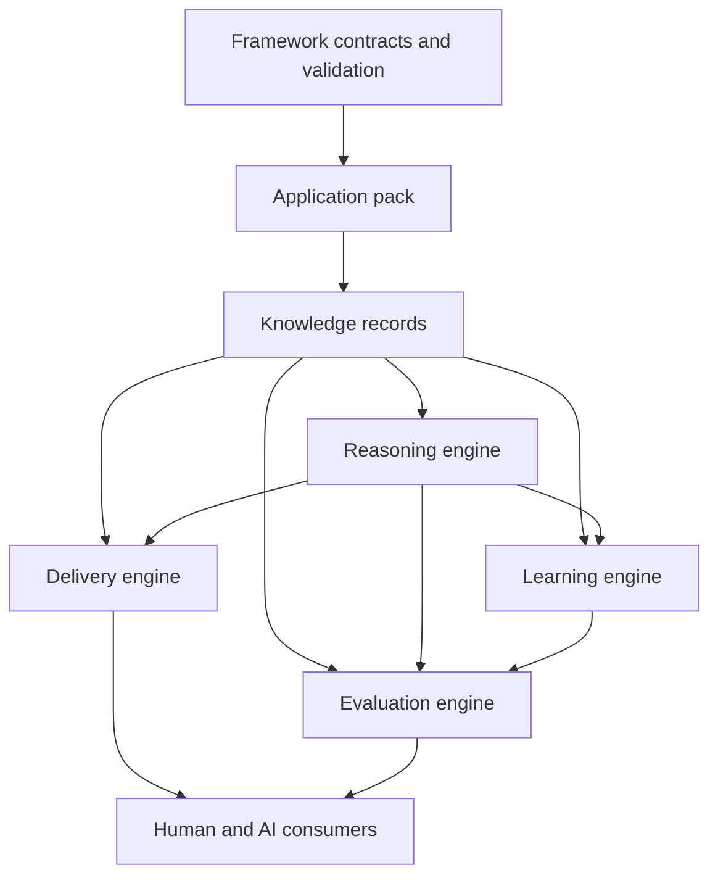

# Architecture Overview

## Purpose

A Knowledge Companion is an evidence-backed projection of what is known about a software system,
why it became that way, how parts relate, what may be stale, and how confidently conclusions can be
drawn. It is not a chat transcript, a documentation website, or a particular search product.

Phase One is a modular monolith of contracts and local tooling. This keeps the model easy to change
while its boundaries mature. Later implementations may split processes or services, but must retain
the contracts and dependency rules described here.

## Layer Model

Arrows mean "defines constraints for or supplies data to," not runtime invocation. Storage and
retrieval are Knowledge Engine ports behind the knowledge layer. Delivery is a projection layer: it
does not become a second source of truth.

## Responsibilities And Dependency Rules

| Layer | Owns | May depend on | Must not own |
| --- | --- | --- | --- |
| Framework | schemas, core vocabulary, validation semantics, extension contracts | stable open standards | application facts, provider behavior |
| Application Pack | pack identity, policies, extension declarations, content discovery | framework contracts | framework implementation |
| Knowledge | evidence-backed records, relationships, provenance, freshness | pack policy and source evidence | chat history, reasoning prompts |
| Reasoning | modes, claim classification, conclusions, uncertainty | retrieved knowledge and explicit user context | mutation of accepted knowledge |
| Learning | change impact, update candidates, classification, review state | change evidence, knowledge, reasoning output | silent approval or direct automatic mutation |
| Evaluation | cases, dimensions, observations, scores, findings | versioned snapshots and engine output | changes to the artifact being evaluated |
| Delivery | mission guides, code tours, task guidance, plans, estimates, onboarding | knowledge and reasoning envelopes | canonical facts that exist only in a rendering |
| Consumers | presentation, interaction, tool-specific adaptation | stable delivery and evaluation outputs | reinterpretation of core epistemic semantics |

The central dependency rule is asymmetric: framework source can understand contract shapes but never
pack content. A pack may declare extensions but cannot redefine required core semantics. Consumers
may render `verified_fact` differently from `inference`, but cannot collapse or relabel it.

## Engine Boundaries

### Knowledge Engine

The Knowledge Engine stores and retrieves records. Its durable boundary is a set of validated
knowledge entries plus provider-neutral retrieval request/result contracts. Results contain ranked
record references, rationales, and explicit limitations without rewriting knowledge. Phase One
defines these shapes and future ports, not a database, index, chunker, ranking algorithm, or
embedding model.

Knowledge entries declare one or more application-neutral areas: Identity, Domain Model,
Architecture, Code, Business, Operational, and Historical knowledge. The areas describe what a
record helps a consumer understand; `kind` describes the record shape. A Code Tour or Mission Guide
may span several areas without becoming a duplicate fact store.

### Reasoning Engine

The Reasoning Engine performs an explicit mode such as explain, compare, trace, debug, estimate, or
plan. Its output is a `reasoning-response`: claims carry evidence references, confidence, and one of
five epistemic statuses. The answer remains inspectable even if the engine changes.

### Learning Engine

The Learning Engine turns repository change evidence into reviewed knowledge evolution. A change
first creates an impact declaration. Required updates become candidates. Candidates move through a
finite review lifecycle and are never accepted merely because a generator proposed them.

### Delivery Engine

The Delivery Engine renders purpose-specific views from accepted knowledge and reasoning output.
Mission Guides, Code Tours, and Task Guides are knowledge records with recognizable content
contracts; they remain traceable to sources and can be evaluated like other outputs.

### Evaluation Engine

The Evaluation Engine executes versioned cases against named snapshots and records dimension-level
scores with evidence. A score without observations is invalid. Evaluation does not edit the
knowledge or reasoning output it judges.

## Durable Data Flow

1. Source evidence exists in a repository or another explicitly identified system.
2. A pack records claims about that evidence in validated knowledge entries.
3. A retriever selects entries without changing them.
4. A reasoning strategy emits a structured response whose claims cite evidence.
5. A delivery renderer presents the response for a human or AI consumer without changing claim
   status.
6. A repository change produces a knowledge-impact declaration.
7. Candidate changes are classified and reviewed; an authorized application step updates records.
8. Evaluation cases compare observable outputs against versioned expectations.

Chat history may provide transient user context at step 4. It is never evidence, accepted knowledge,
or the only record of a decision.

## Source Of Truth

- [`../vision.md`](../vision.md) owns long-term product intent and desired capabilities.
- Schemas own structural validity.
- This architecture documentation owns semantic meaning and layer boundaries.
- Application packs own application knowledge and policy.
- Source repositories and cited systems own the evidence to which records point.
- Generated delivery artifacts are projections, not replacements for accepted knowledge.
- Validation results and evaluation results are observations, not truth by themselves.

When two artifacts conflict, retain the conflict, lower confidence where appropriate, and route it
through review. Do not silently choose the newer or more convenient statement.

## Phase One Runtime Shape

The only executable component is the local reference validator. It discovers records from
`pack.yaml`, validates them against schemas, then performs referential, lifecycle, freshness, and
path-safety checks. It does not retrieve knowledge, reason about it, generate candidates, apply
updates, or call external services.

## Architectural Fitness Rules

Future changes should be rejected or redesigned if they:

- require framework code to recognize an application, language, repository layout, or AI vendor
- make accepted claims possible without provenance or epistemic status
- allow generated candidates to bypass review
- make an engine's internal storage format the public contract
- copy canonical facts into consumer-specific artifacts without traceability
- prevent a second implementation language from honoring the same contracts
- hide stale knowledge by treating freshness warnings as successful verification
